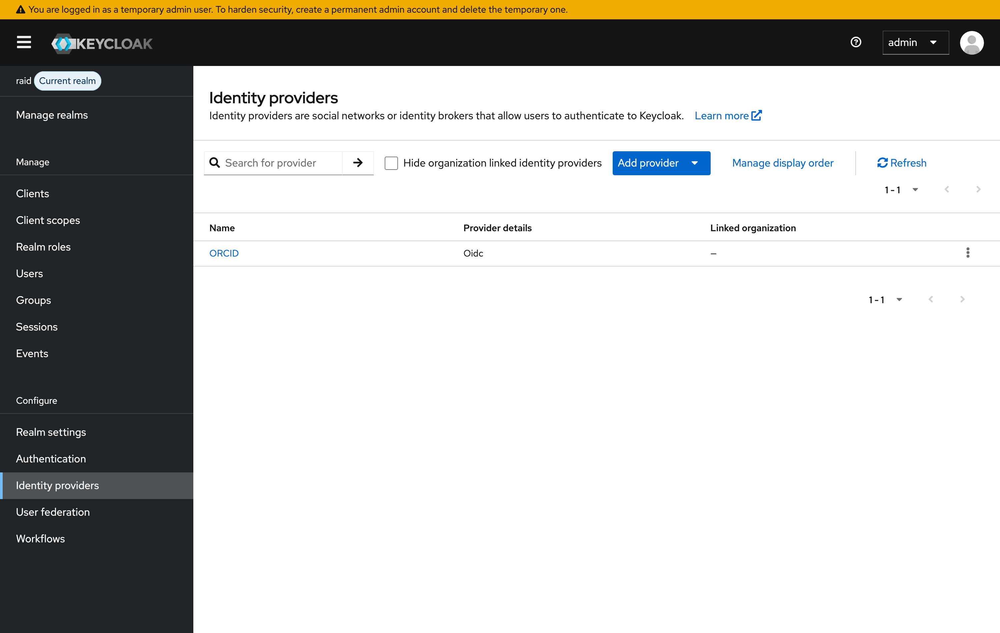
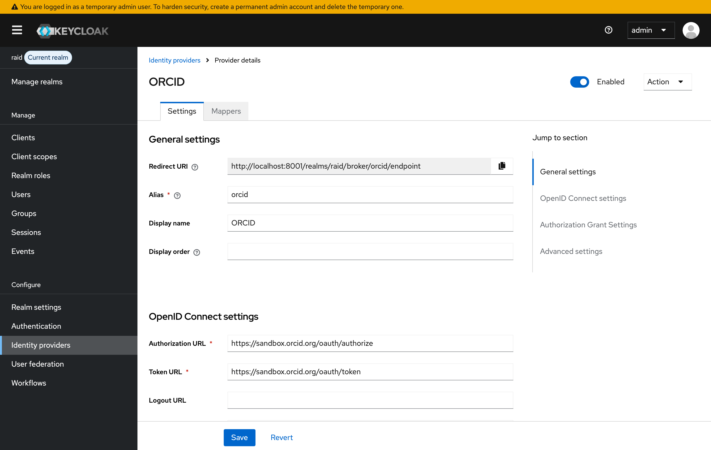
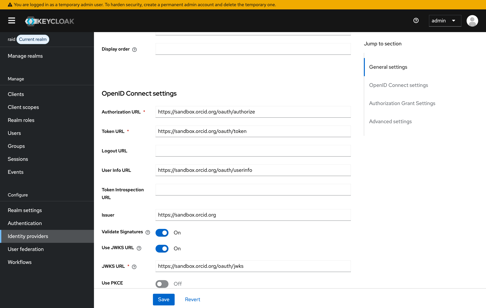
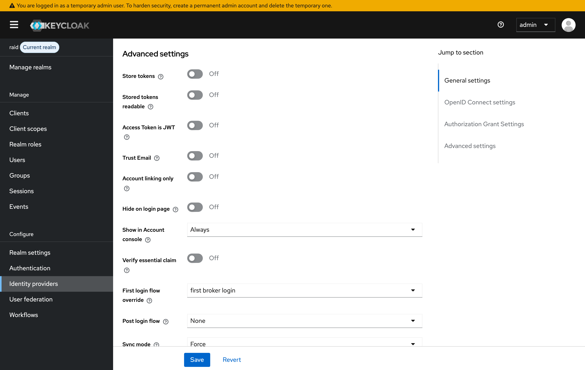
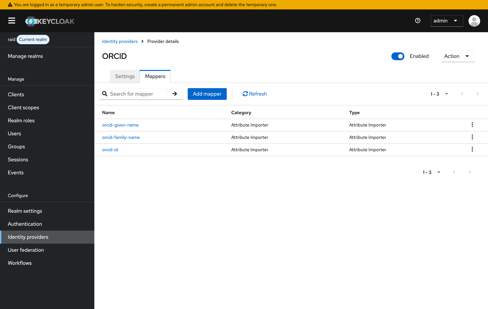
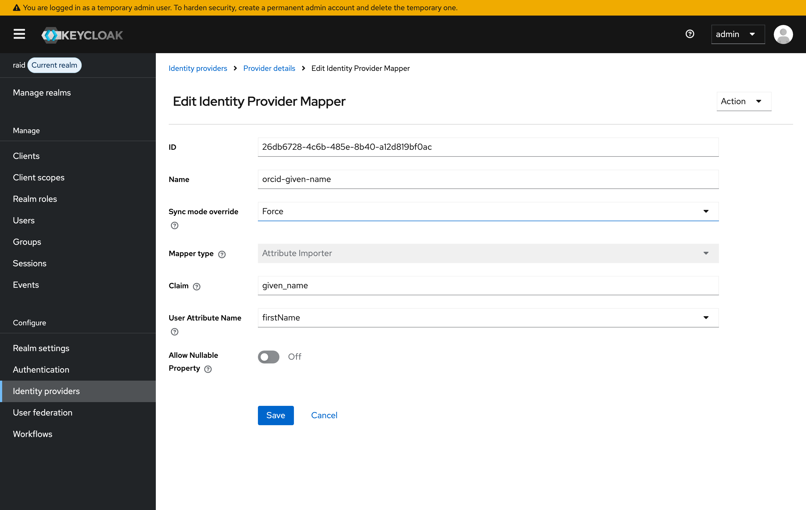

# ORCID Identity Provider Configuration

This guide explains how to configure ORCID as a login identity provider in a RAiD
Keycloak realm, and how to stop the ORCID iD being written into a user's **First Name**.

It applies to any RAiD registration agency running its own Keycloak. The shipped
`iam/realms/raid-realm.json` contains no identity providers, so each agency configures
ORCID itself.

> This guide covers ORCID **login**. It is unrelated to the RAiD-ORCID updater, which
> writes RAiD information to ORCID records and is operated centrally by the ARDC.

## The problem

After a user signs in with ORCID for the first time, their RAiD account is created with
the ORCID iD in the **First Name** field, and the ORCID iD is also used as the username.

This happens with a default ORCID identity provider that has no attribute mappers. Two
things combine to cause it.

### 1. ORCID does not release the claims Keycloak looks for by default

ORCID's discovery document at `https://orcid.org/.well-known/openid-configuration`
(and the sandbox equivalent) advertises:

```
scopes_supported  = ["openid"]
claims_supported  = ["family_name", "given_name", "name", "auth_time", "iss", "sub"]
```

There is no `email` claim and no `preferred_username` claim, and `sub` is the ORCID iD.

Just as important, ORCID returns `given_name`, `family_name` and `name` from the
**userinfo endpoint only**. Its `id_token` carries `sub`, `iss`, `aud`, `auth_time`,
`exp`, `iat`, `nonce` and `jti`, and no name claims at all.

### 2. Keycloak's fallbacks then pick the ORCID iD

`OIDCIdentityProvider.extractIdentity` resolves the username as
`preferred_username`, then `email`, then the subject identifier. ORCID supplies neither
of the first two, so **the username becomes the ORCID iD**.

For the name, Keycloak sets `firstName` only when a `given_name` claim is present. When
`given_name` and `family_name` are both missing it falls back to the deprecated
`BrokeredIdentityContext.setName(name)`, which splits on the last space, and assigns the
**entire string to `firstName`** when the value contains no space.

So if the userinfo call is not made, or returns no usable name, nothing populates
First Name correctly and the ORCID iD is what the user sees.

## The fix

Point the identity provider at ORCID's userinfo endpoint, then add explicit
**Attribute Importer** mappers so the right claim lands in the right field rather than
relying on Keycloak's fallbacks.

### Automated

`scripts/configure-orcid-idp.sh` in the repository root applies the whole configuration
and is idempotent, so it is safe to re-run.

```bash
KC_URL=https://iam.example.org \
KC_REALM=raid \
KC_ADMIN=admin \
KC_ADMIN_PASSWORD=<admin password> \
ORCID_BASE=https://orcid.org \
ORCID_CLIENT_ID=APP-XXXXXXXXXXXXXXXX \
ORCID_CLIENT_SECRET=<client secret> \
./scripts/configure-orcid-idp.sh
```

Use `ORCID_BASE=https://sandbox.orcid.org` against a sandbox ORCID membership. The
manual steps below produce exactly the same result.

### 1. Create the identity provider

Navigate to **Identity providers** in the `raid` realm and add an **OpenID Connect v1.0**
provider with the alias `orcid`.



Set the display name to `ORCID` and copy the **Redirect URI** shown on this screen. That
URI must be registered with ORCID support, otherwise the authorisation request is
rejected.



### 2. Configure the OpenID Connect endpoints

Expand **Advanced** within the OpenID Connect settings section and fill in the endpoints.
**User Info URL is the setting that matters most here** — without it, Keycloak never
retrieves the user's name from ORCID and the fallbacks described above take over.

| Field | Production | Sandbox |
|-------|-----------|---------|
| Authorization URL | `https://orcid.org/oauth/authorize` | `https://sandbox.orcid.org/oauth/authorize` |
| Token URL | `https://orcid.org/oauth/token` | `https://sandbox.orcid.org/oauth/token` |
| User Info URL | `https://orcid.org/oauth/userinfo` | `https://sandbox.orcid.org/oauth/userinfo` |
| JWKS URL | `https://orcid.org/oauth/jwks` | `https://sandbox.orcid.org/oauth/jwks` |
| Issuer | `https://orcid.org` | `https://sandbox.orcid.org` |



Also confirm:

- **Client authentication**: `Client secret sent in the request body`
- **Scopes**: `openid` — this is the only scope ORCID's OIDC endpoint supports
- **Disable user info**: off
- **Validate Signatures** and **Use JWKS URL**: on

Enter the **Client ID** and **Client Secret** from your ORCID member API credentials.

### 3. Set the login flow and sync mode

In **Advanced settings**, set **First login flow override** to `first broker login` and
**Sync mode** to `Force`.

`Force` is what repairs accounts that already exist. The default sync mode only applies
mappers when the account is first created, so users who already have the ORCID iD in
their First Name would keep it. With `Force`, their profile is re-imported from ORCID on
their next login and corrects itself.



### 4. Add the attribute mappers

Open the **Mappers** tab and add three mappers of type **Attribute Importer**, each with
**Sync mode override** set to `Force`.

| Name | Claim | User Attribute Name |
|------|-------|---------------------|
| `orcid-given-name` | `given_name` | `firstName` |
| `orcid-family-name` | `family_name` | `lastName` |
| `orcid-id` | `sub` | `orcid` |



The first mapper is the one that answers the reported problem: it takes ORCID's
`given_name` claim and writes it to `firstName` explicitly, so Keycloak's name-splitting
fallback is never reached.



The third mapper keeps the ORCID iD, but as a dedicated `orcid` user attribute rather
than as the user's displayed name. This is what lets the app show a user's ORCID iD on
their profile without it masquerading as their first name.

## About the username

The mappers above fix the **First Name** and **Last Name** fields. The username is a
separate question and is worth a deliberate decision rather than a default.

ORCID supplies no `email` and no `preferred_username`, so Keycloak has nothing to build
a username from except the ORCID iD. The options are:

- **Keep the ORCID iD as the username (recommended).** It is globally unique, stable for
  the life of the researcher, and never collides. Once the mappers above are in place the
  ORCID iD is no longer visible as the user's name, which addresses the substance of the
  complaint. Keycloak usernames are an internal identifier and need not be human-friendly.
- **Derive it from the name** using a **Username Template Importer** mapper with a
  template such as `${CLAIM.given_name}.${CLAIM.family_name}`. This reads better, but
  names are neither unique nor stable, so it will collide between two researchers with the
  same name and will drift when someone changes their name.

Because the second option trades a guarantee for cosmetics, this guide does not configure
it. Add a Username Template Importer deliberately if your agency wants it.

## Limitation: private ORCID names

No Keycloak configuration can populate First Name if ORCID does not release the name.

ORCID applies the record's visibility setting to the name it returns from userinfo. If a
user's name is not set to public visibility, `given_name` and `family_name` are omitted
and the mappers have nothing to import. Those users will need to either make their name
public on their ORCID record or complete their profile in RAiD.

If you need users to be able to correct their own details at first login, re-enable the
**Review Profile** execution in the **First Broker Login** flow. Note that
[login-page-configuration.md](login-page-configuration.md) currently instructs agencies to
disable it, which means a missing name is silently accepted.

## Verifying

After configuring, sign in with a test ORCID account and check the user record under
**Users** in the admin console:

- **First name** holds the given name from the ORCID record, not the ORCID iD
- **Last name** holds the family name
- The **Attributes** tab has an `orcid` attribute holding the ORCID iD

To confirm what ORCID is actually releasing for a given account, call the userinfo
endpoint directly with an access token for that user:

```bash
curl -H "Authorization: Bearer <access token>" https://orcid.org/oauth/userinfo
```

If `given_name` is absent from that response, the problem is the ORCID record's name
visibility, not the Keycloak configuration.

## References

- [ORCID OpenID Connect documentation](https://github.com/ORCID/ORCID-Source/blob/main/orcid-web/ORCID_AUTH_WITH_OPENID_CONNECT.md)
- [ORCID OIDC discovery document](https://orcid.org/.well-known/openid-configuration)
- [login-page-configuration.md](login-page-configuration.md) — realm theme, localisation and first broker login flow
